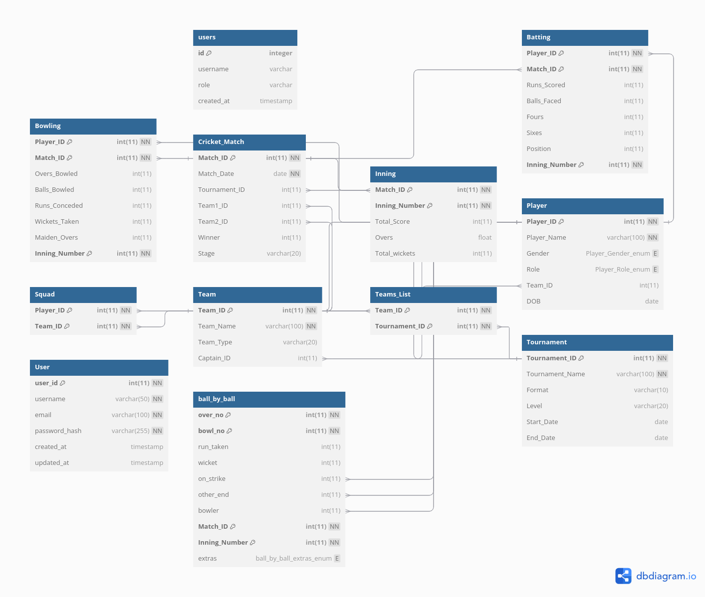
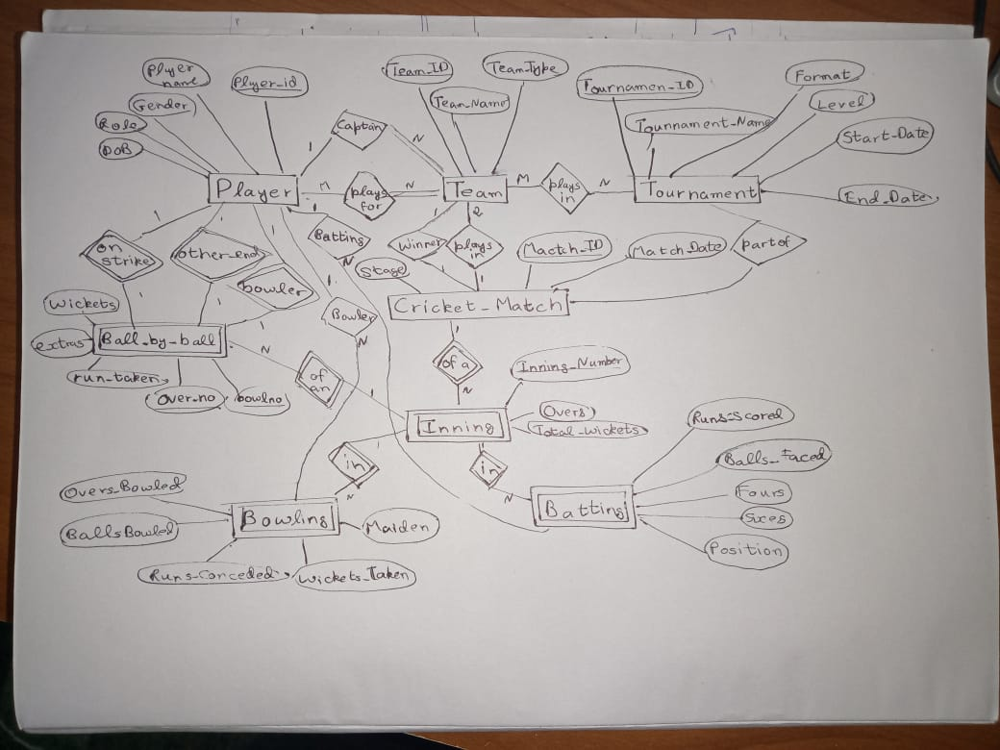

# CricketTeamSelector

### Web App for cricket stats+team selection


# Schema 

# ER Diagram

---
# Installation
```bash
git clone https://github.com/muniss950/CricketTeamSelector
```
---
# Running 
## Backend
```bash
cd backend
pip install -r requirements.txt
python app.py
```
## Frontend
```bash
cd frontend
npm install
npm start
```
